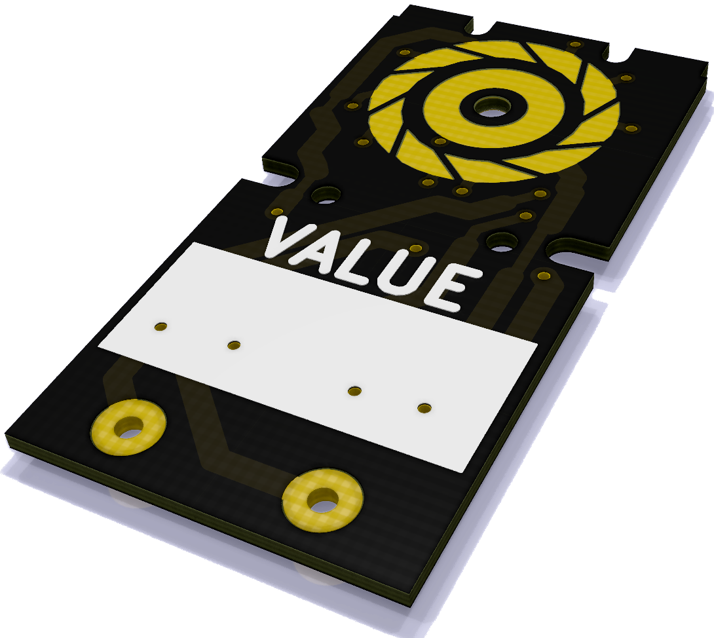

# KA-3 Decade Box

This contains the source code for a decade box built with the KM2 thumbwheel
switches. These KM2 switches can be sourced from typical China exporters, like
AliExpress. Typical prices are $3.5-$5 per 10 piece lot.

It has been re-designed from scratch to make use of a fully open-source
toolchain, KiCad & FreeCAD. The break-before-make varient is not supported by
this revision.

## Getting Started

If you're just looking to manufacture some of these boards, check out the
gerbers in `exports/`. <!-- WIP: There are two sets of gerbers: an under
100x100mm panel, and a single board -->

You will also want to buy 9 of each power of ten resistor. The resistors are
all SMD 1206 package, and are designed to dissipate up to a quarter watt each.

## Directory Strucure

This directory contains the CAD files.

`reverse-engineering/` contains the files used to come up with the correct
board outline.

`exports/` contains the output files, in a format where they can be sent to the
manufactuer.

## Credits & License

- [Original Design © Piotr Zapart, 2016][og]. [CC-BY-SA-3.0][]
- [Make-before-break design by Dave, 2016][mbb-dave]

[og]: https://github.com/hexeguitar/DecadeRbox
[CC-BY-SA-3.0]: https://creativecommons.org/licenses/by-sa/3.0/
[mbb-dave]: https://www.eevblog.com/forum/projects/yet-another-resistance-decade-box/msg941946/#msg941946

You may use any part of this project under the [CC-BY-SA-3.0][] license.
